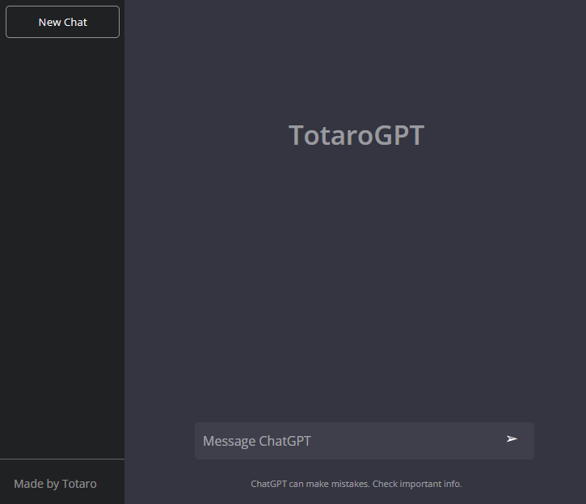
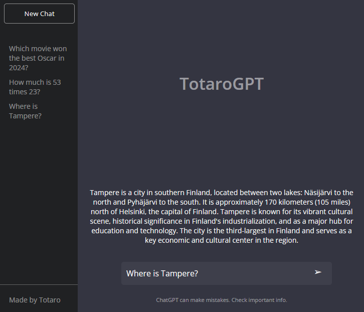

# Javascript ChatGPT Clone
ChatGPT clone using JavaScript, HTML, CSS and OpenAI API with sidebar that contains previous chat message history and new chat function.

Opening view

Chat with three previous messages on the sidebar and the latest chatgpt response to the question "Where is Tampere?". You can click the history message from the sidebar and get that message back to chat input. New Chat -button clears the chat input and you can write another chat message.

My personal OpenAI API key is not uploaded onto GitHub. <h6>(_This is the reason why this project is not live in githup pages_)</h6>

Get your API key from: https://platform.openai.com/docs/api-reference/authentication
